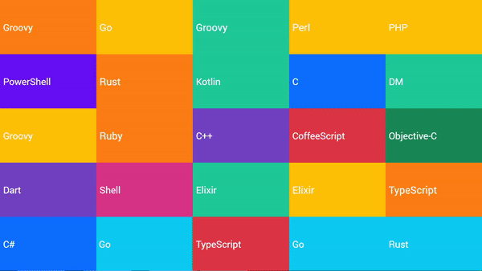

# Trend Grid
This project allows you to create an animated trending grid similar to [Google Trends](https://trends.google.com/trends/hottrends/visualize?nrow=5&ncol=5).

<a href="https://trend-grid.vercel.app/" target="_blank">
    <br /><br />
</a>

## [Demo](https://trend-grid.vercel.app/trends/?trends=C%2CC%23%2CC%2B%2B%2CCoffeeScript%2CCSS%2CDart%2CDM%2CElixir%2CGo%2CGroovy%2CHTML%2CJava%2CJavaScript%2CKotlin%2CObjective-C%2CPerl%2CPHP%2CPowerShell%2CPython%2CRuby%2CRust%2CScala%2CShell%2CSwift%2CTypeScript)

[](https://trend-grid.vercel.app/trends/?trends=C%2CC%23%2CC%2B%2B%2CCoffeeScript%2CCSS%2CDart%2CDM%2CElixir%2CGo%2CGroovy%2CHTML%2CJava%2CJavaScript%2CKotlin%2CObjective-C%2CPerl%2CPHP%2CPowerShell%2CPython%2CRuby%2CRust%2CScala%2CShell%2CSwift%2CTypeScript)

## Example
Put this code in your website
```html
<iframe src="https://trend-grid.vercel.app/trends/" id="trends" frameborder="0" style="width: 480px; height: 270px;" allowfullscreen></iframe>

<script>
  const trends = document.getElementById('trends')

  window.addEventListener('message', async ({ data }) => {
    if (!Array.isArray(data)) return
    const [command, content] = data
    if (command !== 'fetch-trends') return
    trends.contentWindow.postMessage(['data', await fetchData()], '*')
  })

  async function fetchData() {
    // TODO: Implement this
    // const data = await fetch('/api...').then((response) => response.json())
    // return data
    return ['Trends', 'Hello', 'World', '...']
  }
</script>
```

## API
```
https://trend-grid.vercel.app/trends/
https://trend-grid.vercel.app/trends/?trends=Example,Test
```

### Params
`trends` - Trends separated by comma
`colors` - CSS colors separated by comma
`animations` - Multiple of these: `left`, `right`, `top`, `bottom`, `back` (separated by comma)
`minTime` - Minimum time the trend will displayed (milisseconds)
`maxTime` - Maximum time the trend will displayed (milisseconds)
`maxFontSize` - Maximum font size of text
`gridColumns` - Amount of grid columns
`gridRows` - Amount of grid rows
`refreshTime` - API data refresh time
`dontShrinkText` - Set to `1` to disable font size shrink (may improve performance)
`allowUnsafeHTML` - Allow unsafe HTML inside trends
